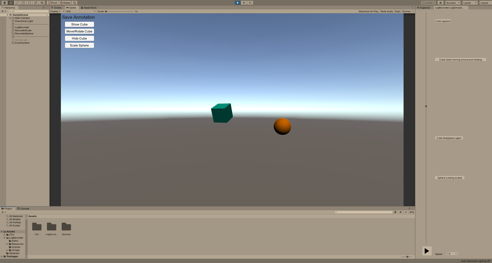

# Unity Log Recorder
Utility for recording Unity GameObjects' properties for later evaluation and playback.
Allows to log properties like position or time together with annotations as `csv` files and provides a simple GUI to playback the recorded states like a video inside the Unity Editor.



## When to use
This utility was developed for the recording of user studies in HCI experiments powered by Unity applications.\
In general it is useful in all kinds of settings where a resimulation or playback of virtual objects over time is needed.\
For example in an experiment, it is useful to log how virtual objects were moved and annotate these logs with experimental conditions or timestamps. This allows researchers to later evaluate these logs and helps to determine the cause of outliers in certain conditions.

## How to record
To get an idea of how to use this utility, we will have a look at how the [example scene](UnityLogRecorder/Assets/LogRecorder/Scenes/SampleScene.unity) was built. An example for a simulation of a recording in this scene can be seen in the image above or by simply entering game mode in this scene.\
The scene contains 2 gameobjects (a cube and a sphere) we want to record.

### Set recording mode
The central component managing this utility is the `LogSimulator` which allows you to switch between recording and playback. It offers the following settings:
* `Mode`: either `SIMULATE` (playback the newest recording), `RECORD` (in game mode) or `NONE` (deactivated)
* `Disable Logic`: an event called in `SIMULATE` mode

The `Disable Logic` event can be used to disable all game logic which would interfere with a simulation. For example if the game logic activates or deactives gameobjects, we do not want this to happen during a simulation but only see what has been recorded.\
In our example, we deactive a gameobject called `GameLogic`.

### LoggerController
To log the properties of a gameobject in Unity, it needs a `LoggerController` componenent attached which bundles all `Logger` results into a single `csv` file. It provides the following settings:
* `Save Log`: If this component should record and save its logs for the next time running the application.
* `File Name`: Name of saved file, will be saved to `Assets/CSV/<name>.csv`.
* `Log Mode`: Log entries can be created `EACH_FRAME`, every `Wait Interval` frames (`WAIT_INTERVAL`) or only when the trigger `LoggerController.Trigger()` or `LoggerController.TriggerLog()` is called by other scripts.
* `Wait Interval`: Number of frames between saves in `WAIT_INTERVAL` mode.

So we attach a `LoggerController` component to the sphere and the cube.

### Loggers
To record different properties, different components deriving from type `Logger` are used. Currently the following types are already implemented (though this list can easily grow):
* `FrameLogger` is a special type and will be created automatically if none is found on the `LoggerController`'s GameObject.
* `AnnotationLogger` is a special type used to annotate the log with a message.
* `PositionLogger` logs the position of an object as 3D vector.
* `RotationLogger` logs the rotation of an object as quaternion.
* `ScaleLogger` logs the scale of an object as 3D vector.
* `TimeLogger` logs the current time in seconds since start.
* `ActivationLogger` logs if the object is activated in the scene.

In our example, we want to record position, rotation and activation for the cube as well as scale and time for the sphere. 

### Create a custom logger
You are free to implement as many custom logger types as you would like. Simply write a class extending either the abstract `Logger` class or the more specific `FloatLogger` class. Any `Logger` needs to implement the following interface:
```
// Returns the name of this logger type.
public abstract string GetName();

// Returns the current observed value description.
public abstract string GetValue();

// Interprets and applies the given value description.
public abstract void SetValue(string value);
```
For an example illustrating how to put this interface to use, please see the [`ActivationLogger`](UnityLogRecorder/Assets/LogRecorder/Scripts/Loggers/ActivationLogger.cs).\
The `FloatLogger` is an extension thereof which adds a parameter for the user to set in the UnityEditor depending on precision needs:
```
[Tooltip("Number of decimal points saved for floating point attributes")]
public int decimalPoints = 4;
```
A good example for this type is the [`PositionLogger`](UnityLogRecorder/Assets/LogRecorder/Scripts/Loggers/PositionLogger.cs).

### Add annotations
To enable logging of annotations in the style `Cube has been moved`, we add `AnnotationLogger` components to both our sphere and cube.\
In a real scenario, logging of annotations would be triggered by other scripts like an experiment manager in the style `Condition A has started` or `User finished task X`.\
However in the example scene, we can simply simulate this with a bunch of button on screen which call the `LoggerController.TriggerLog()` function on the cube and sphere accordingly. So we annotate our recording by pressing the buttons at the appropriate times.

## How to playback a recording
When play mode is ended in `RECORD` mode, the `LoggerController` components save all their logs to a new folder under [`CSV`](UnityLogRecorder/Assets/CSV/). These are enumerated starting at 0, so your previous recordings will never be overwritten.\
To playback the newest recording (with highest number as folder name), select `SIMULATE` mode in the `LogSimulator` and enter play mode in the Unity Editor.
Now your recorded session is simulated using the property which have been logged and you can see the cube moving just like it was recorded.\

### Log Simulator Window
To enhance your experience of rewatching a recording, this utility also provides a custom editor window under `Windows->Log Simulator` (in the top menu). You can place it anywhere on your screen, e.g. besides the inspector like in the screenshot above.\
As you can see, it offers a play/pause button as well as a selection of different playback speed but the easiest way to navigate through your recording is by simply dragging the slider which is disguised as a timeline.\
Furthermore right next to this timeline, all of your recorded annotations are displayed according to their time as clickable button which will take you exactly to the point in the simulation where this annotation was logged.

## Issues and Contributions
In case you face any issues with using this utility, please feel free to open an issue here on GitHub.\
And if you implemented your own useful `Logger` extensions, improved the playback GUI or would like to contribute in some form to this utility project, please open a pull request.
